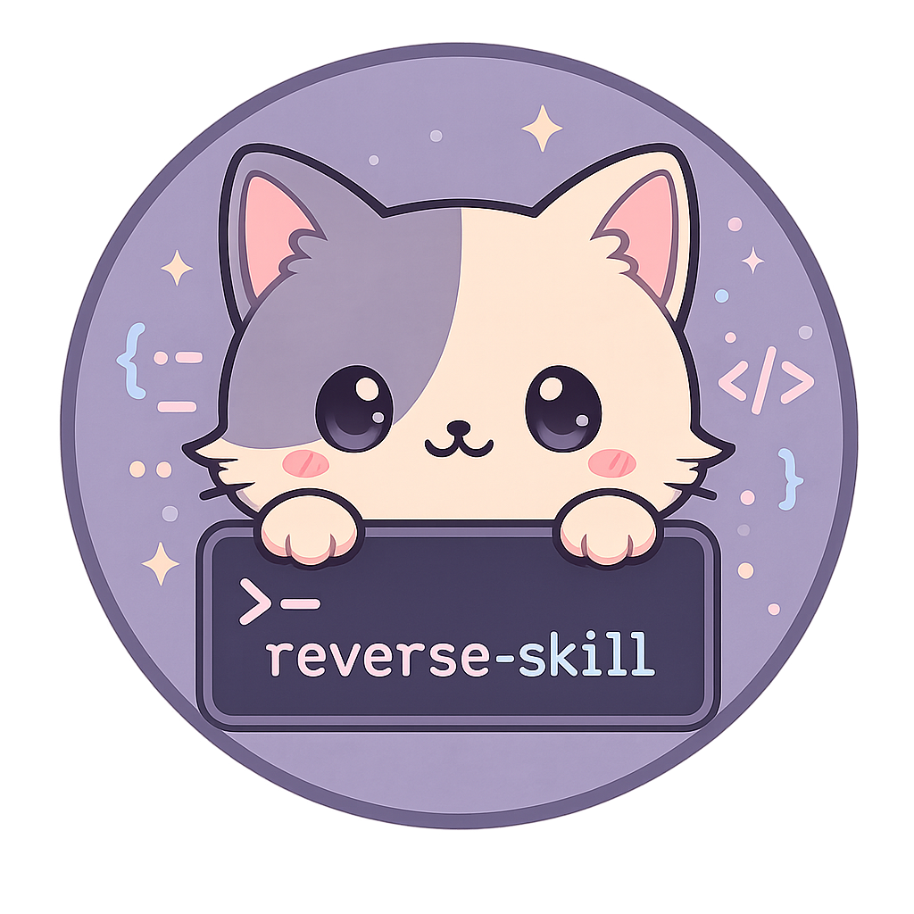

<p align="center">
  
</p>

<h1 align="center">reverse-skill</h1>
<h3 align="center">Reverse Engineering / Authorized Penetration Testing / Security Research Skill Router Pack</h3>


<p align="center">AI-powered routing + On-demand toolchain bootstrapping + Self-evolving knowledge base<br/>

<p align="center">
  <a href="https://github.com/zhaoxuya520/reverse-skill/releases"></a>
  <a href="https://github.com/zhaoxuya520/reverse-skill/stargazers"></a>
  <a href="https://github.com/zhaoxuya520/reverse-skill/forks"></a>
  <a href="https://github.com/zhaoxuya520/reverse-skill/issues"></a>
  <a href="LICENSE"></a>
  <a href="CHANGELOG.md"></a>
</p>

<p align="center">
  <a href="https://trendshift.io/repositories/43969?utm_source=trendshift-badge&amp;utm_medium=badge&amp;utm_campaign=badge-trendshift-43969" target="_blank" rel="noopener noreferrer"></a>
</p>

<br/>

<p align="center">
</p>

<p align="center">
  🌐 <a href="README.md">English</a>
</p>

<br/>


```
用户任务
  → RULES.md
  → MASTER-ROUTING / master-route.ps1（PRIMARY）
  → case-init / scope.md（授权 + network_profile；未就绪禁止对目标 ACT）
  → 目标 Skill → 工具 / MCP / 脚本
  → timeline + Evidence→Finding→Path → 报告 + field-journal
```


|---:|---:|---:|---|---|


<br/>

<div align="center">
  <a href="https://star-history.com/#zhaoxuya520/reverse-skill&Date">
    
  </a>
</div>

<br/>


<p align="left">
  <br/>
  <code>IDA Pro</code> · <code>radare2</code> · <code>Ghidra</code>
</p>


```
git clone https://github.com/zhaoxuya520/reverse-skill.git
```


- **Kali Linux** → [kali/README-kali.md](kali/README-kali.md)
- **Ubuntu/Debian** → [docs/platforms/linux.md](docs/platforms/linux.md)
- **macOS** → [docs/platforms/macos.md](docs/platforms/macos.md)


|------|------|
| .NET / C# | `skills/dotnet-reverse/` |
| API / GraphQL | `skills/api-security/` |


|------|------|


```powershell
# 路由回归（163 条）
powershell -NoProfile -ExecutionPolicy Bypass -File skills/scripts/test-routing.ps1
# 结构一致性 + 供应链版本固定门禁
powershell -NoProfile -ExecutionPolicy Bypass -File skills/scripts/verify-routing-coherence.ps1
# 冒烟与 INDEX 漂移检查
powershell -NoProfile -ExecutionPolicy Bypass -File skills/scripts/smoke.ps1
powershell -NoProfile -ExecutionPolicy Bypass -File skills/scripts/extract-summaries.ps1 -Check
```


```
.
├── README.md (English) / README_zh.md / README_AI.md
├── RULES.md / RULES_zh.md     # 全局路由（含 scope 门）
├── skills/
│   ├── MASTER-ROUTING.md      # PRIMARY 快路径
│   ├── SKILL.md / routing.md  # 总控 + 三轴矩阵
│   ├── ops/                   # Scope / 证据链 / 角色 / 时间线
│   ├── scripts/               # master-route / case-init / bootstrap / verify
│   ├── field-journal/         # 脱敏经验
│   ├── apk-reverse/ mobile-reverse/ js-reverse/ dotnet-reverse/
│   ├── ida-reverse/ radare2/ reverse-engineering/ malware-analysis/
│   ├── pentest-tools/ attack-chain/ pwn-chain/ firmware-pentest/
│   ├── patch-diff-exploit/ edr-bypass-re/ binary-diff/
│   ├── api-security/ supply-chain-security/ llm-security/
│   ├── browser-automation/ diagram-generator/ docs-generator/
│   └── ...
├── CTF-Sandbox-Orchestrator/  # CTF 子技能
├── docs/                      # 平台与架构
├── kali/                      # Kali 脚本与 README-kali.md
└── work/                      # 本地 case 产物（gitignore）
```


<table align="center">
  <tr>
    <td align="center" width="440">
      <a href="https://www.atlascloud.ai/?ref=W3Q77C">
      </a>
      <br />
      <strong>Atlas Cloud</strong>
      <br />
    </td>
  </tr>
</table>


<p align="center">
  <a href="mailto:24781737@qq.com?subject=%5BSponsorship%5D%20reverse-skill">
  </a>
</p>


2. `git checkout -b feature/AmazingFeature`
3. `git commit -m 'Add some AmazingFeature'`
4. `git push origin feature/AmazingFeature`


<a href="https://github.com/zhaoxuya520/reverse-skill/graphs/contributors">
  
</a>


- **CTF-Sandbox-Orchestrator/**：**GNU GPLv3**
