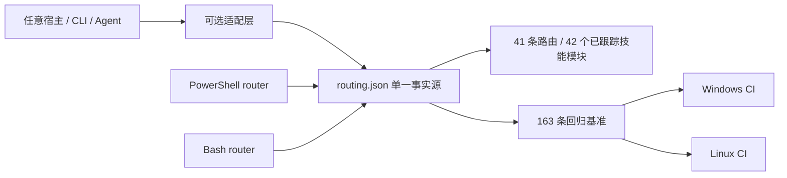

```mermaid
flowchart LR
    C["任意宿主 / CLI / Agent"] --> A["可选适配层"]
    A --> R["routing.json 单一事实源"]
    P["PowerShell router"] --> R
    B["Bash router"] --> R
    R --> S["41 条路由 / 42 个已跟踪技能模块"]
    R --> T["163 条回归基准"]
    T --> W["Windows CI"]
    T --> L["Linux CI"]
```
