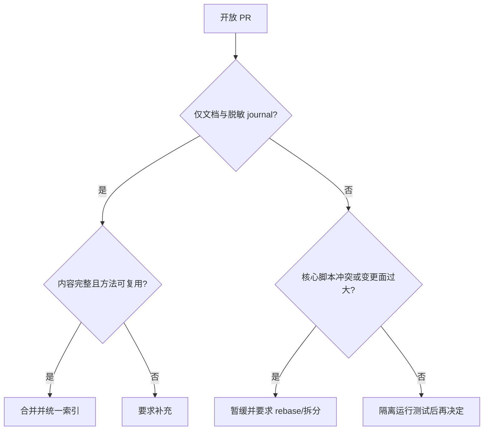

```mermaid
flowchart TD
    A[开放 PR] --> B{仅文档与脱敏 journal?}
    B -->|是| C{内容完整且方法可复用?}
    C -->|是| D[合并并统一索引]
    C -->|否| E[要求补充]
    B -->|否| F{核心脚本冲突或变更面过大?}
    F -->|是| G[暂缓并要求 rebase/拆分]
    F -->|否| H[隔离运行测试后再决定]
```
