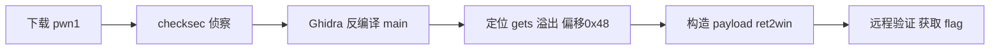

# ctf-demo — Final Report (示例)

> 报告结构参考 `skills/docs-generator/references/security-report-templates.md`。

## 1. 概述

| 项 | 值 |
|----|----|
| 目标 | pwn1 (https://ctf.example.com/challenges/pwn1) |
| 类型 | CTF pwn（栈溢出） |
| 结果 | ✅ flag captured |
| 耗时 | ~1.5h |

## 2. 执行摘要

pwn1 为无 PIE/无 canary 的 64 位 ELF，main 使用 `gets()` 读取 0x40 缓冲区。
通过 0x48 偏移覆盖返回地址，调用程序内 win 函数获取 flag。远程验证成功。

## 3. 时间线

见 `timeline.md`（5 个阶段：init → recon → static → exploit → wrap）。

## 4. 发现

| # | 严重度 | 描述 | 证据 |
|---|--------|------|------|
| F-01 | High (CTF) | gets() 栈溢出，ret 偏移 0x48，可 ROP/ret2win | E-001, E-002, E-003 |

## 5. 攻击路径（Evidence → Finding → Path）



## 6. 复现

```bash
python3 exploit.py REMOTE
```

## 7. 修复建议（若为真实应用）

- 使用 `fgets`/`read` 替代 `gets`
- 开启 canary + PIE + full RELRO
- 部署 ASLR（服务器侧）

## 8. 附注

- field-journal 已脱敏沉淀（无真实目标信息）
