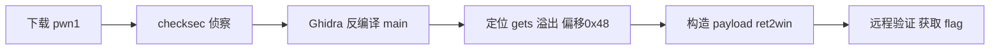

|----|----|


|---|--------|------|------|



```mermaid
graph LR
  A[下载 pwn1] --> B[checksec 侦察]
  B --> C[Ghidra 反编译 main]
  C --> D[定位 gets 溢出 偏移0x48]
  D --> E[构造 payload ret2win]
  E --> F[远程验证 获取 flag]
```


```bash
python3 exploit.py REMOTE
```
